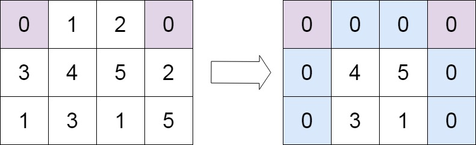

# 73. 矩阵置零

- 题目标签：数组, 哈希表, 矩阵
- 难度级别：中等

## 题目描述

给定一个 `m x n` 的矩阵，如果一个元素为 0，则将其所在行和列的所有元素都设为 0。请使用 **原地** 算法。

- 示例 1：

  

  ```txt
  输入：matrix = [[1,1,1],[1,0,1],[1,1,1]]
  输出：[[1,0,1],[0,0,0],[1,0,1]]
  ```

- 示例 2：

  

  ```txt
  输入：matrix = [[0,1,2,0],[3,4,5,2],[1,3,1,5]]
  输出：[[0,0,0,0],[0,4,5,0],[0,3,1,0]]
  ```

提示：

- `m == matrix.length`
- `n == matrix[0].length`
- `1 <= m, n <= 200`
- `-2^31 <= matrix[i][j] <= 2^31 - 1`

## 题解

解题思路：

1. 新建两个集合：
   1. 行集合记录需要清零的行
   2. 列集合记录需要清零的列
2. 遍历矩阵，发现零现在 **行**、**列** 集合中记录哪些行、列需要清零
3. 遍历集合，依次把矩阵的行、列清零

解题代码：

```ts
function setZeroes(matrix: number[][]): void {
  const m = matrix.length, n = matrix[0].length
  const rows = new Set<number>()
  const cols = new Set<number>()

  // 1. 遍历数组，提取坐标为 0 的行和列
  for (let i = 0; i < m; i++) {
    for (let j = 0; j < n; j++) {
      if (matrix[i][j] === 0) {
        rows.add(i)
        cols.add(j)
      }
    }
  }

  // 2. 遍历集合
  rows.forEach((r) => {
    for (let j = 0; j < n; j++) {
      matrix[r][j] = 0
    }
  })
  cols.forEach((c) => {
    for (let i = 0; i < m; i++) {
      matrix[i][c] = 0
    }
  })
}
```
